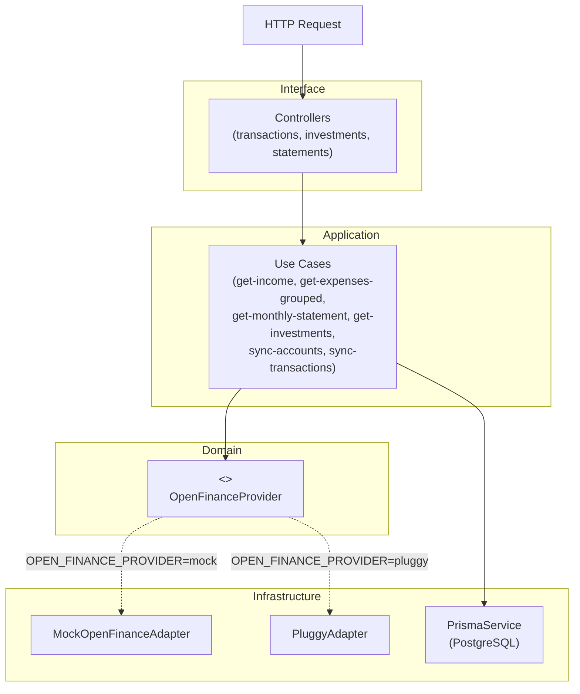

# PROJECT_OVERVIEW

## Visão Geral

API REST de gestão financeira pessoal que agrega dados de contas bancárias, transações e investimentos via Open Finance. O sistema sincroniza dados de um provedor externo (Pluggy ou mock), persiste no banco local e expõe endpoints para consulta de receitas, gastos por categoria, extrato mensal e carteira de investimentos.

O público-alvo é um usuário final único (por ora, `userId` fixo em `demo-user`) que deseja uma visão consolidada das suas finanças. O projeto serve também como referência de arquitetura — seu propósito explícito é demonstrar Arquitetura Hexagonal com DIP (Dependency Inversion Principle) aplicada ao contexto de Open Finance.

---

## Stack Técnica

| Camada | Tecnologia |
|---|---|
| Runtime | Node.js + TypeScript 5 |
| Framework | NestJS 10 |
| ORM / Banco | Prisma 5 + PostgreSQL |
| Open Finance | Pluggy (real) / Mock (dev) |
| Validação | class-validator + class-transformer |
| Testes | Jest + Supertest |
| Build | `@nestjs/cli` |

**Serviços externos:**
- **Pluggy** — provedor de Open Finance para conexão com bancos brasileiros (credenciais via `PLUGGY_CLIENT_ID` / `PLUGGY_CLIENT_SECRET`). Ainda não implementado (ver Status Atual).

---

## Arquitetura

Arquitetura Hexagonal: o domínio não depende de nenhum detalhe de infraestrutura. O ponto de inversão é o token `OPEN_FINANCE_PROVIDER`, resolvido em runtime via variável de ambiente.



A seleção do adapter ocorre em `OpenFinanceModule` via `useFactory`, lendo `OPEN_FINANCE_PROVIDER` do `.env`.

---

## Estrutura de Pastas

```
finance-api/
├── prisma/
│   └── schema.prisma          # Modelos: Account, Transaction, Investment
├── src/
│   ├── app.module.ts          # Raiz do NestJS, importa todos os módulos
│   ├── main.ts                # Bootstrap da aplicação
│   ├── shared/
│   │   └── prisma/            # PrismaService + PrismaModule (singleton global)
│   └── modules/
│       ├── open-finance/      # Domínio central: port + adapters + sync use cases
│       │   ├── domain/
│       │   │   ├── entities/  # AccountEntity, TransactionEntity, InvestmentEntity
│       │   │   └── ports/     # OpenFinanceProvider (interface + token DI)
│       │   ├── application/
│       │   │   └── use-cases/ # SyncAccountsUseCase, SyncTransactionsUseCase
│       │   └── infrastructure/
│       │       └── adapters/
│       │           ├── mock/  # MockOpenFinanceAdapter (dados fake)
│       │           └── pluggy/ # PluggyAdapter (integração real — não implementada)
│       ├── transactions/      # GET /income, GET /expenses/grouped
│       ├── investments/       # GET /investments
│       └── statements/        # GET /statements/:yearMonth
└── .env / .env.example        # Configuração local
```

---

## Fluxos Principais

### 1. Sincronização de contas (Open Finance → banco local)

1. Chamador invoca `SyncAccountsUseCase.execute(userId, connectionId)`
2. O use case chama `OpenFinanceProvider.fetchAccounts(connectionId)` — interface agnóstica ao provedor
3. O adapter selecionado (mock ou Pluggy) retorna `AccountEntity[]`
4. O use case faz `upsert` de cada conta no PostgreSQL via Prisma

### 2. Sincronização de transações

1. Chamador invoca `SyncTransactionsUseCase.execute(connectionId, since)`
2. Provider retorna `TransactionEntity[]` com `direction`, `category`, `amount`, `sourceLabel`
3. Use case mapeia enums de domínio → enums Prisma e faz `upsert` por `externalId`
4. Retorna a quantidade de transações processadas

> **Nota:** Nenhum endpoint HTTP aciona a sincronização ainda — os use cases de sync são exportados pelo `OpenFinanceModule` mas não estão conectados a um controller ou job agendado.

### 3. Consulta de gastos por categoria

```
GET /expenses/grouped?month=2026-08
```
1. `TransactionsController` chama `GetExpensesGroupedUseCase.execute('demo-user', '2026-08')`
2. Use case calcula o intervalo de datas via `monthRange(month)` → `[2026-08-01, 2026-09-01)`
3. Prisma executa `groupBy(['category'])` filtrando `EXPENSE` + `userId` + período
4. Retorna lista `{ category, total, count }[]`

### 4. Extrato mensal

```
GET /statements/2026-08
```
1. `StatementsController` chama `GetMonthlyStatementUseCase`
2. Busca todas as transações do mês ordenadas por data
3. Calcula `totalIncome`, `totalExpense` e `balance` inline
4. Retorna `{ month, totalIncome, totalExpense, balance, timeline[] }`

---

## Convenções e Decisões Importantes

| Decisão | Motivo |
|---|---|
| **Arquitetura Hexagonal + DIP** | O domínio (`domain/`) não importa nada de NestJS, Prisma ou Pluggy. Troca de provedor sem tocar no domínio. |
| **Token de injeção via `Symbol`** | `OPEN_FINANCE_PROVIDER` como Symbol evita colisão de strings e torna o contrato explícito no container de DI do NestJS. |
| **Seleção de adapter via env var em runtime** | `useFactory` no módulo resolve qual adapter injetar com base em `OPEN_FINANCE_PROVIDER`. Sem `if` espalhado pelo código. |
| **`userId` fixo (`'demo-user'`)** | Autenticação ainda não implementada. Todos os controllers usam string literal até JWT ser adicionado. |
| **Upsert por `externalId`** | Sincronizações são idempotentes — rodar duas vezes não duplica dados. |
| **`monthRange` com `Date.UTC`** | Evita bugs de fuso horário na geração de filtros de data. |
| **Enums duplicados (domínio vs Prisma)** | Entidades de domínio têm seus próprios enums; o use case faz o mapeamento explícito. Evita que o schema do banco vaze para o domínio. |

---

## Glossário

| Termo | Significado |
|---|---|
| **Open Finance** | Sistema regulatório brasileiro que obriga bancos a expor dados via API padronizada |
| **Pluggy** | Empresa que agrega APIs de Open Finance de múltiplos bancos brasileiros |
| **connectionId** | Identificador de uma conexão estabelecida entre o usuário e um banco via Open Finance |
| **externalId** | ID da entidade no sistema do provedor (Pluggy), usado como chave de upsert local |
| **Port** | Termo hexagonal para interface que o domínio define e a infraestrutura implementa |
| **Adapter** | Implementação concreta de um Port (ex: `PluggyAdapter`, `MockOpenFinanceAdapter`) |
| **sourceLabel** | Descrição legível da origem de uma transação (ex: `"Empresa X - Salario"`, `"Supermercado Extra"`) |
| **direction** | `INCOME` (entrada) ou `EXPENSE` (saída) de uma transação |
| **yearMonth** | Formato de parâmetro de data: `"2026-08"` (ano-mês) |

---

## Status Atual

### Funcional
- Estrutura modular completa (NestJS + Prisma + PostgreSQL)
- Schema do banco com `Account`, `Transaction`, `Investment`
- Adapter mock com dados fake para desenvolvimento sem credenciais
- Use cases de sincronização (`sync-accounts`, `sync-transactions`)
- Endpoints de leitura: `/income`, `/expenses/grouped`, `/statements/:yearMonth`, `/investments`
- Seleção de provider via variável de ambiente

### Incompleto / Não implementado
- `PluggyAdapter` — todos os métodos lançam `Error('Not implemented')`. Nenhuma chamada real à API Pluggy existe.
- **Autenticação** — `userId` fixo em `'demo-user'` em todos os controllers. JWT não implementado.
- **Trigger de sincronização** — os use cases de sync existem mas nenhum controller ou job os aciona. Dados só existem no banco se inseridos manualmente ou via testes.
- `GetInvestmentsUseCase` — [A confirmar] não lido em detalhe, verificar se consulta o banco ou o provider.
- Testes — estrutura de teste configurada (Jest + Supertest) mas nenhum arquivo de teste encontrado em `src/`.

### Débitos técnicos conhecidos
- Mapeamento de enums domínio → Prisma em `SyncTransactionsUseCase` usa cast frágil (`as unknown as keyof typeof`)
- Sem paginação nos endpoints de listagem
- Sem tratamento de erros HTTP padronizado (sem filtros de exceção globais)
