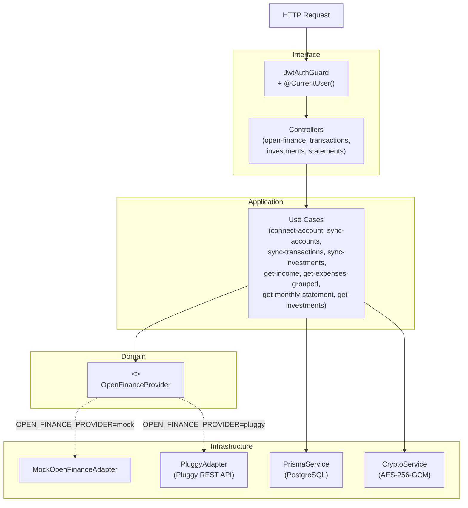

# PROJECT_OVERVIEW

## Visão Geral

API REST de gestão financeira pessoal que agrega dados de contas bancárias, transações e investimentos via Open Finance. O sistema autentica usuários com JWT, conecta-se a bancos via Pluggy (ou mock para desenvolvimento), sincroniza os dados para um banco PostgreSQL local e expõe endpoints para consulta de receitas, gastos por categoria, extrato mensal e carteira de investimentos.

O projeto serve também como referência de arquitetura — demonstra Arquitetura Hexagonal com DIP (Dependency Inversion Principle) aplicada ao contexto de Open Finance. Trocar o provedor de dados (ex: Pluggy → Belvo) exige modificar apenas um arquivo.

---

## Stack Técnica

| Camada | Tecnologia |
|---|---|
| Runtime | Node.js + TypeScript 5 |
| Framework | NestJS 10 |
| ORM / Banco | Prisma 5 + PostgreSQL |
| Autenticação | `@nestjs/jwt` + `@nestjs/passport` + `bcrypt` |
| Criptografia | AES-256-GCM (Node.js `crypto` nativo) |
| Open Finance | Pluggy REST API / MockAdapter (dev) |
| Validação | `class-validator` + `class-transformer` |
| Documentação | `@nestjs/swagger` (Swagger UI em `/docs`) |
| Testes | Jest (unitários) + Supertest (e2e) |
| Build | `@nestjs/cli` |

**Serviços externos:**
- **Pluggy** — agrega APIs Open Finance de bancos brasileiros. Autenticação via `POST /auth` (token com TTL de 2h, renovado automaticamente). Credenciais de sandbox: `connectorId: 2`, `user: "user-ok"`, `password: "password-ok"`.

---

## Arquitetura

Arquitetura Hexagonal: o domínio não importa nada de NestJS, Prisma ou Pluggy. O ponto de inversão é o token `OPEN_FINANCE_PROVIDER`, resolvido em runtime pela variável de ambiente homônima.



---

## Estrutura de Pastas

```
finance-api/
├── prisma/
│   ├── schema.prisma              # Modelos: User, Connection, Account, Transaction, Investment
│   └── migrations/                # Histórico de migrations aplicadas
├── src/
│   ├── app.module.ts              # Raiz do NestJS
│   ├── main.ts                    # Bootstrap + Swagger
│   ├── shared/
│   │   ├── crypto/                # CryptoService (encrypt/decrypt AES-256-GCM)
│   │   ├── dto/                   # MonthQueryDto (validação compartilhada)
│   │   ├── pipes/                 # ParseMonthPipe (valida path params YYYY-MM)
│   │   └── prisma/                # PrismaService + PrismaModule
│   └── modules/
│       ├── auth/                  # Registro, login, JwtStrategy, JwtAuthGuard, @CurrentUser()
│       │   ├── auth.controller.ts
│       │   ├── auth.service.ts
│       │   ├── auth.module.ts
│       │   ├── jwt.strategy.ts
│       │   ├── jwt-auth.guard.ts
│       │   ├── current-user.decorator.ts
│       │   └── dto/auth.dto.ts
│       ├── open-finance/
│       │   ├── domain/
│       │   │   ├── entities/      # AccountEntity, TransactionEntity, InvestmentEntity
│       │   │   └── ports/         # OpenFinanceProvider (interface + token DI)
│       │   ├── application/
│       │   │   └── use-cases/     # connect-account, sync-accounts, sync-transactions, sync-investments
│       │   ├── infrastructure/
│       │   │   └── adapters/
│       │   │       ├── mock/      # MockOpenFinanceAdapter (dados determinísticos)
│       │   │       └── pluggy/    # PluggyAdapter (REST API real)
│       │   ├── dto/               # ConnectAccountDto
│       │   └── interface/         # OpenFinanceController (POST /connections)
│       ├── transactions/          # GET /income, GET /expenses/grouped
│       ├── investments/           # GET /investments
│       └── statements/            # GET /statements/:yearMonth
└── test/
    ├── jest-e2e.json
    └── e2e/
        └── finance.e2e-spec.ts    # 16 testes e2e com banco real
```

---

## Fluxos Principais

### 1. Autenticação

```
POST /auth/register  ou  POST /auth/login
  → AuthService valida credenciais (bcrypt.compare)
  → JwtService.sign({ sub: userId, email }) → token JWT (7 dias)
  → Retorna { accessToken }

Requests subsequentes:
  Authorization: Bearer <token>
  → JwtAuthGuard → JwtStrategy.validate() → req.user = { userId, email }
  → @CurrentUser() extrai userId para os use cases
```

### 2. Conexão com banco (Open Finance)

```
POST /connections  { credentials: { connectorId, parameters } }
  → ConnectAccountUseCase
  → OpenFinanceProvider.connectAccount() — Pluggy: POST /items; Mock: ID sintético
  → CryptoService.encrypt(JSON.stringify(credentials))  ← AES-256-GCM, IV aleatório
  → prisma.connection.upsert({ credentialsEnc })
  → Retorna { connectionId, status }
```

### 3. Sincronização (Open Finance → banco local)

```
POST /connections/:id/sync
  → SyncAccountsUseCase   → provider.fetchAccounts()   → prisma.account.upsert()
  → SyncTransactionsUseCase (paralelo com investments)
      → provider.fetchTransactions(since)  → paginação cursor (Pluggy)
      → prisma.transaction.upsert() por externalId  ← idempotente
  → SyncInvestmentsUseCase
      → provider.fetchInvestments() → prisma.investment.upsert()
  → Retorna { connectionId, syncedAt, transactions: N, investments: N }
```

### 4. Consulta de dados

```
GET /expenses/grouped?month=2026-08
  → MonthQueryDto valida YYYY-MM (regex: /^\d{4}-(0[1-9]|1[0-2])$/)
  → GetExpensesGroupedUseCase
  → prisma.transaction.groupBy(['category'])
      WHERE direction=EXPENSE AND date IN [2026-08-01, 2026-09-01) AND account.userId=<jwt>
  → [{ category, total, count }]
```

---

## Convenções e Decisões Importantes

| Decisão | Motivo |
|---|---|
| **Arquitetura Hexagonal + DIP** | `domain/` não importa NestJS, Prisma ou Pluggy. Trocar de provedor = 1 linha no `.env`. |
| **Token de injeção via `Symbol`** | `OPEN_FINANCE_PROVIDER` como `Symbol` evita colisão de strings; torna o contrato explícito no container de DI. |
| **Seleção de adapter via `useFactory`** | Resolve o adapter em runtime sem `if` espalhado. Ambos os adapters ficam instanciados; o token define qual é entregue. |
| **Credenciais criptografadas com AES-256-GCM** | GCM fornece autenticação embutida: adulteração do ciphertext lança erro antes de decriptar. IV aleatório por chamada garante que mesmas credenciais geram ciphertexts distintos. |
| **Token Pluggy cacheado (TTL 1h50m)** | Token válido por 2h; cache evita um roundtrip extra por request. Renovação automática ao expirar. |
| **Upsert por `externalId`** | Sincronizações são idempotentes — rodar duas vezes não duplica dados. |
| **`monthRange` com `Date.UTC`** | Evita bugs de fuso horário na geração dos filtros de data. |
| **Enums duplicados (domínio vs Prisma)** | Entidades de domínio têm seus próprios enums; use cases fazem o mapeamento explícito. Schema do banco não vaza para o domínio. |
| **`ParseMonthPipe` para path params** | `ValidationPipe` global só processa DTOs; path params string precisam de pipe explícito. |
| **Seed de e2e via HTTP** | `beforeAll` registra usuário e aciona sync via Supertest — testa o stack real em vez de inserir dados diretamente no banco. |

---

## Glossário

| Termo | Significado |
|---|---|
| **Open Finance** | Sistema regulatório brasileiro que obriga bancos a expor dados via API padronizada |
| **Pluggy** | Empresa que agrega APIs Open Finance de múltiplos bancos brasileiros |
| **Item** | Termo da Pluggy para uma conexão ativa com um banco (equivale ao `connectionId` no domínio) |
| **connectorId** | ID numérico do banco/instituição no catálogo da Pluggy (ex: `2` = sandbox de testes) |
| **connectionId** | UUID da conexão no banco local (= `item.id` retornado pela Pluggy) |
| **externalId** | ID da entidade no sistema do provedor, usado como chave de upsert local |
| **Port** | Termo hexagonal para interface que o domínio define e a infraestrutura implementa |
| **Adapter** | Implementação concreta de um Port (`PluggyAdapter`, `MockOpenFinanceAdapter`) |
| **sourceLabel** | Descrição legível da transação (`"Empresa X - Salario"`, `"Supermercado Extra"`) |
| **direction** | `INCOME` (entrada) ou `EXPENSE` (saída) de uma transação |
| **yearMonth** | Formato de parâmetro de data: `"2026-08"` (YYYY-MM) |
| **credentialsEnc** | Campo no banco: `iv:authTag:ciphertext` em hex (AES-256-GCM) |

---

## Status Atual

### Funcional

- Autenticação completa: registro, login, JWT, guard, `@CurrentUser()`
- Schema do banco: `User`, `Connection`, `Account`, `Transaction`, `Investment`
- `MockOpenFinanceAdapter` com dados determinísticos para dev/testes
- `PluggyAdapter` implementado: auth com cache de token, `connectAccount`, `fetchAccounts`, `fetchTransactions` (paginação cursor), `fetchInvestments`
- Criptografia de credenciais em repouso: AES-256-GCM com IV aleatório por chamada
- Endpoints de sync: `POST /connections`, `POST /connections/:id/sync`
- Endpoints de leitura com validação JWT e `@CurrentUser()`: `/income`, `/expenses/grouped`, `/investments`, `/statements/:yearMonth`
- Validação de formato de mês com `MonthQueryDto` + `ParseMonthPipe` (regex `YYYY-MM`, rejeita mês 13)
- Swagger UI com autenticação Bearer configurada em `/docs`
- 16 testes unitários: use cases de sync, leitura e `CryptoService`
- 16 testes e2e: stack HTTP completo com banco real, seed via mock, cobertura dos 4 endpoints

### Débitos técnicos conhecidos

- Mapeamento de enums domínio → Prisma em `SyncTransactionsUseCase` usa cast (`as unknown as keyof typeof`) — candidato a refatoração com função de mapeamento explícita
- Sem paginação nos endpoints de leitura (`/income`, `/investments`, `/statements`)
- Sem global exception filter — erros inesperados expõem stack trace em desenvolvimento
- `fetchInvestments` da Pluggy associa todos os investimentos à primeira conta do item (Pluggy não retorna `accountId` por investimento)
- Status `PENDING`/`UPDATING` de itens Pluggy não tem tratamento de retry ou webhook
